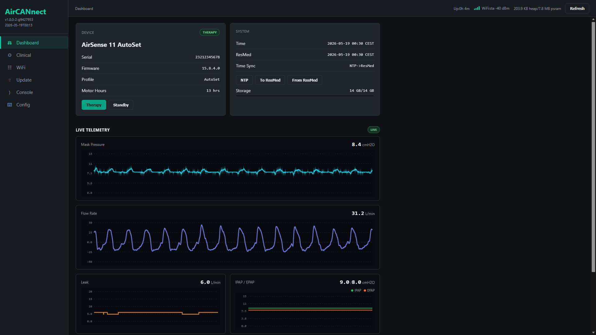
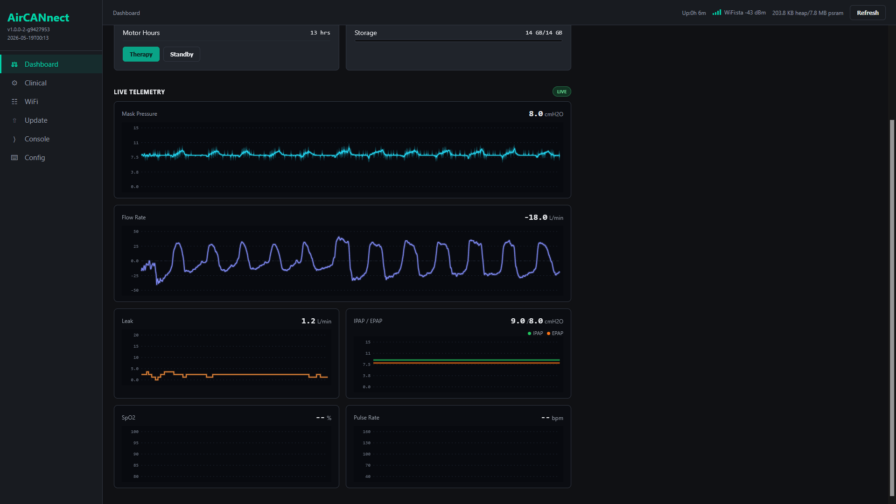
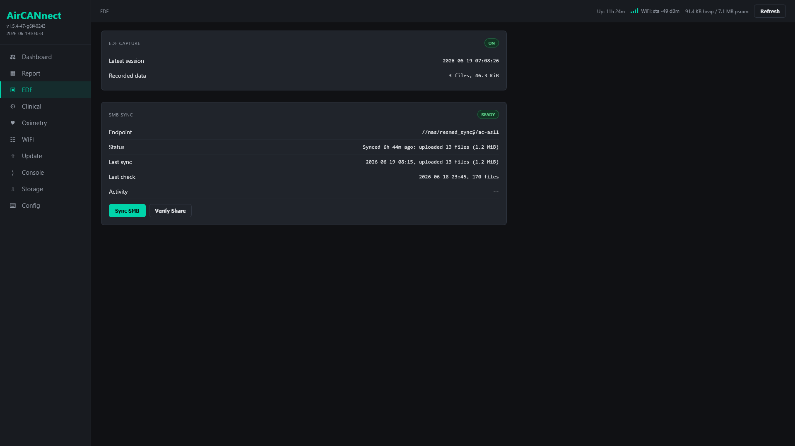
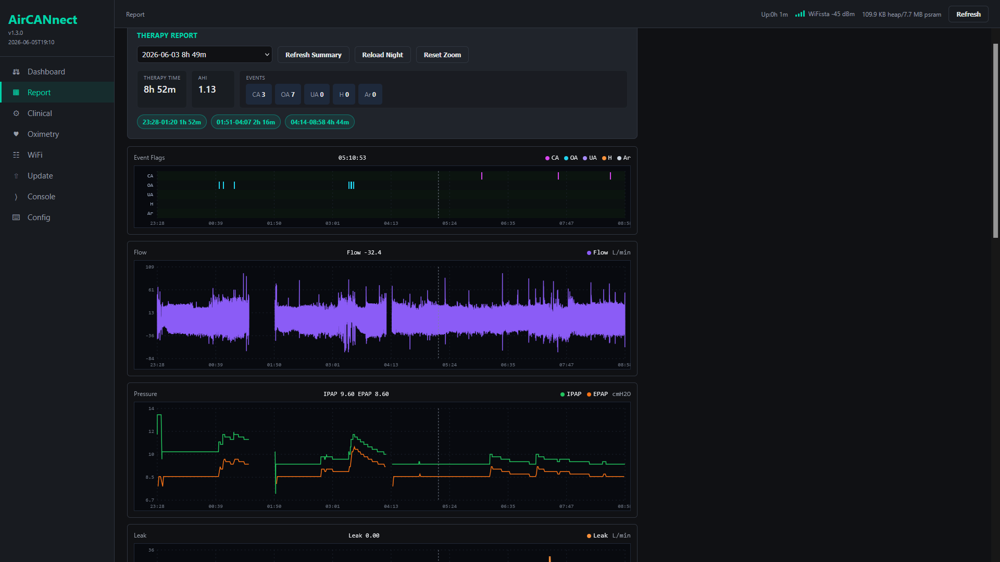
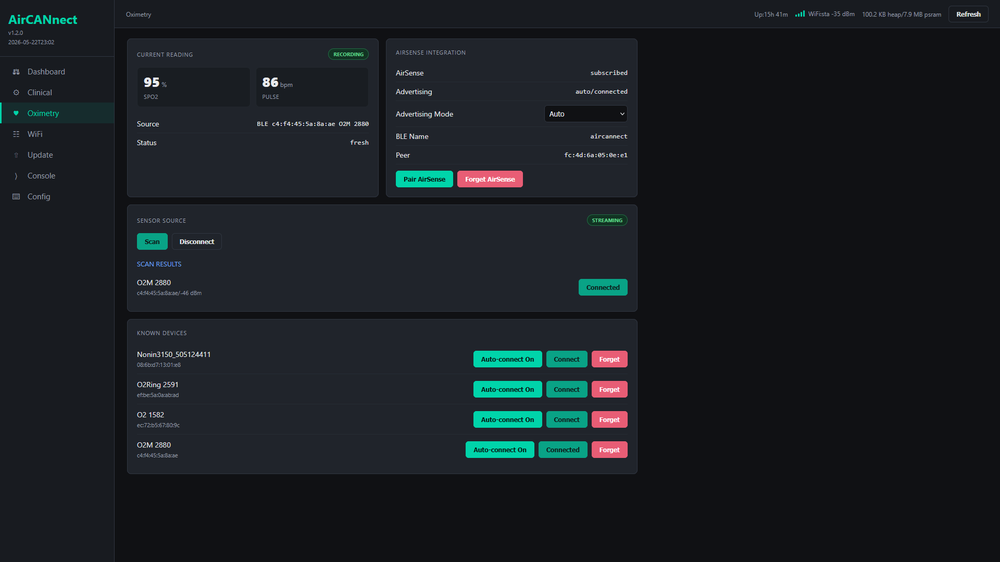
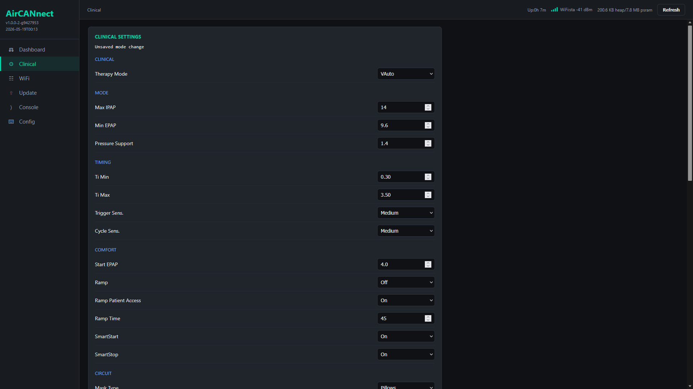
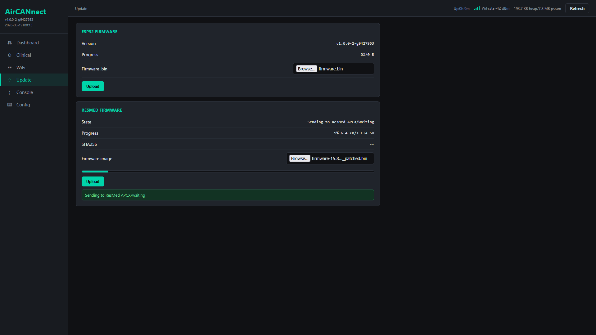

# AirCANnect

ESP32 bridge for ResMed AirSense 11 / AirCurve 11 CPAP.

Using an AirSense 10? See [AirBridge](https://github.com/m-kozlowski/airbridge).

## What it does

- **Web UI** 
  - live dashboard with AS11 status and identity
  - read/write all therapy settings
  - live pressure / flow / leak / SpO2 charts
- **EDF capture**
  - record active therapy sessions to AS11-style EDF files on SD card
  - browse and download captured EDF files over the Web UI
  - SMB share sync
- **Reports**
  - therapy-night charts with event flags, session toggles, zoom, and cached data
- **Oximetry**
  - use supported BLE oximeters or UDP sources with AirSense 11 HR/SpO2 recording
  - currently supported: O2Ring, O2Ring-S, Checkme O2, Nonin 3150, generic PLX/HR sensors
- **Time sync**
  - NTP-first with AS11 clock fallback
  - Optional AirSense time synchronization - fixes RTC drift issue
- **Raw TCP bridge**
  - send commands to AirSense over WiFi. \
    (one JSON-RPC payload per line, compatible with `as11_config.py` and other host tooling.)
- **Multi-profile Wi-Fi**
  - up to four STA profiles, BSSID-targeted roaming, SoftAP auto-fallback or forced always-on.
- **ResMed OTA**
  - flash AirSense firmware from web UI or CLI. \
    (Autodetects firmware format (raw or .abc container) and target memory block)

## Planned

- **Live therapy data sinks** - HTTP, SleepHQ, MQTT... Plugin sinks subscribe through the stream broker; bounded per-consumer queues
- **BLE provisioning** - replace SoftAP-only first-run with a BLE service for Wi-Fi scan, multi-profile setup, and basic device config from a phone.

## First setup

1. Wire up the [hardware](docs/hardware.md).
2. Flash: `pio run -e xiao-esp32s3-plus-sdmmc4 -t upload`
3. Open `http://aircannect/` (default login: `admin` / `aircannect`).

For a longer walkthrough see the [quickstart](docs/quickstart.md).

## Build profiles

- `xiao-esp32s3-plus-sdmmc4` *(default)* - XIAO ESP32-S3 Plus, 4-bit microSD on the exposed non-strapping GPIOs.
- `xiao-esp32s3-plus-sdmmc1` - same board, 1-bit SDMMC.
- `xiao-esp32s3-plus-spisd` - same board, SPI-mode SD fallback.
- `xiao-esp32s3-plus` - no SD; PSRAM still available for stream pool and response buffers.

<!--
## Related tools

[airbreak-plus](https://github.com/m-kozlowski/airbreak-plus/tree/master/python/) has Python tooling that should use the generic AirCANnect host transport:

- `python/as11_config.py -p tcp:aircannect` - read/write AS11 settings, run RPC calls, follow streams.
- `python/as11_flash.py -p tcp:aircannect` - upload ResMed firmware through the same transport.

Both also support `-p /dev/ttyUSB0` for direct serial CAN tooling on hardware that exposes it.
-->

## Screenshots

| Live charts | EDF |
|---|---|
|  |  |

| Reports | Oximetry |
|---|---|
|  |  |

| Clinical settings | ResMed OTA |
|---|---|
|  |  |

## License

AGPL v3. See [LICENSE](LICENSE).
