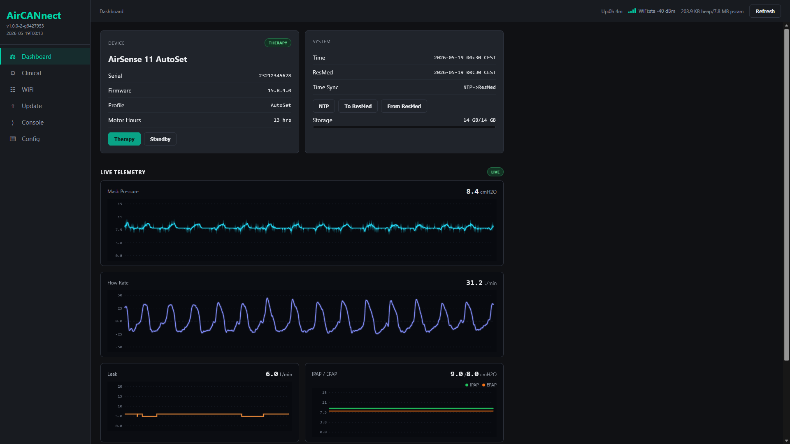
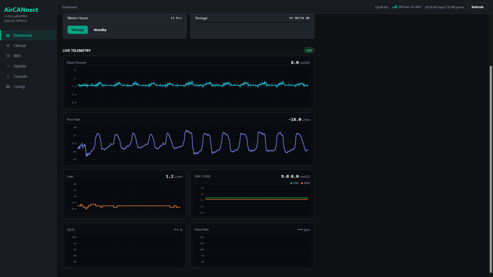
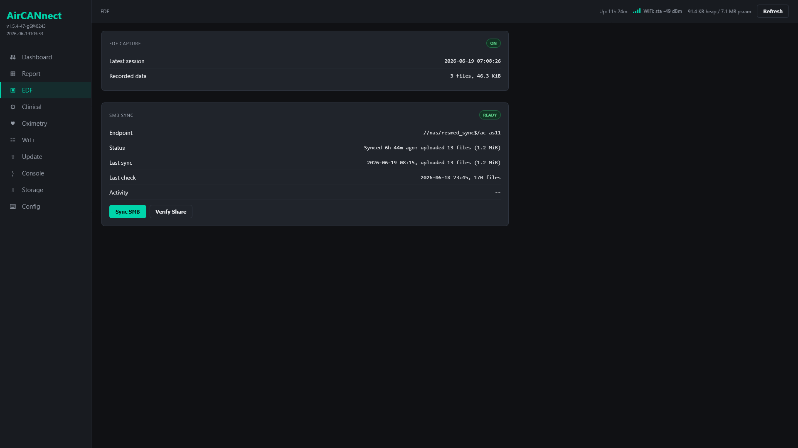
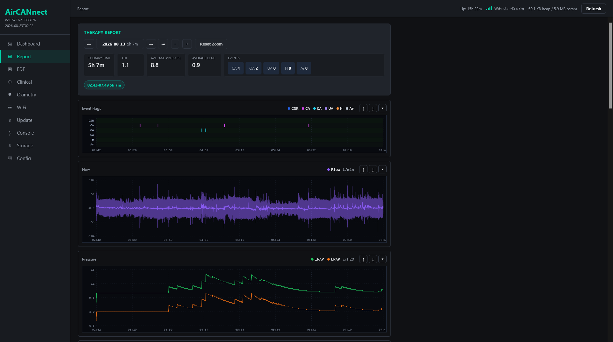
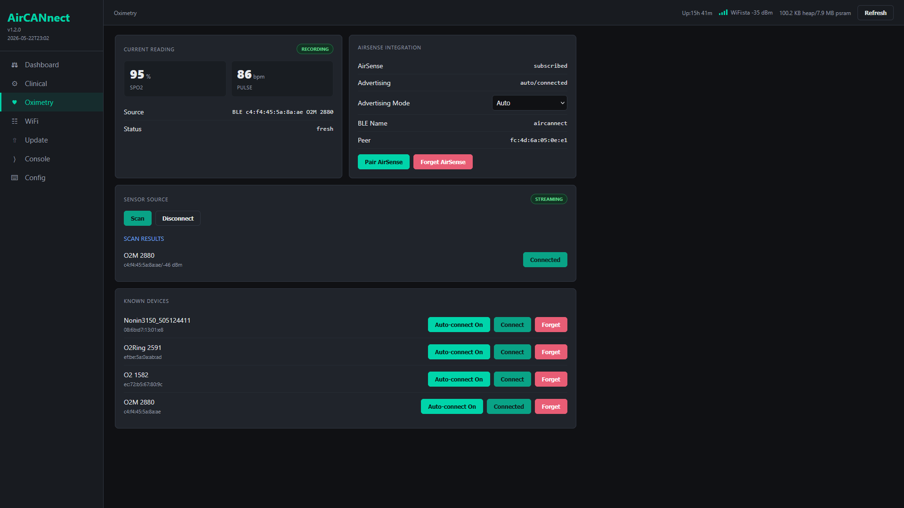
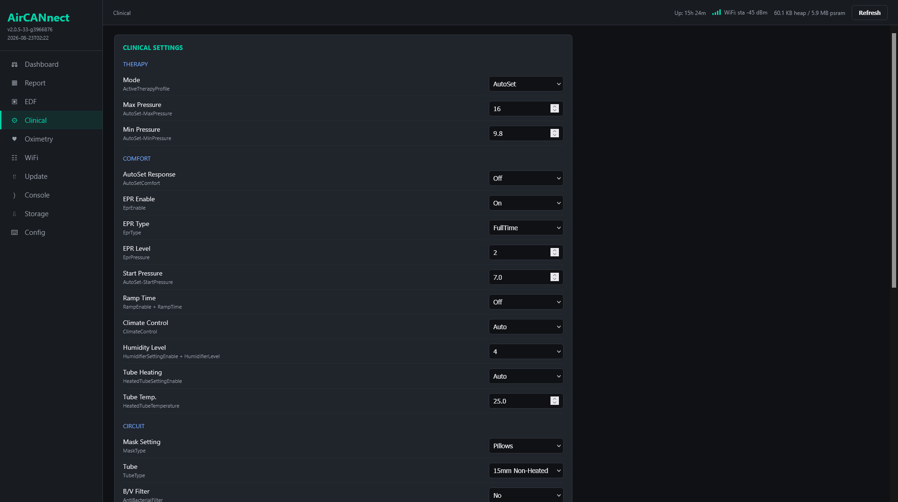
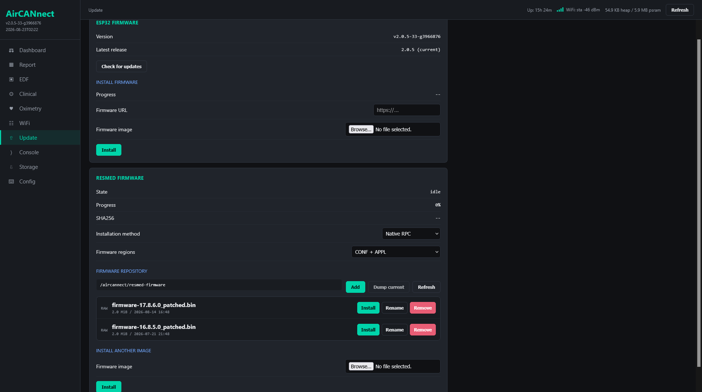

# AirCANnect

ESP32 bridge for ResMed AirSense 11 / AirCurve 11 CPAP.

Using an AirSense 10? See [AirBridge](https://github.com/m-kozlowski/airbridge).

## What it does

- **Web UI** 
  - live dashboard with AS11 status and identity
  - read/write all therapy settings
  - live pressure / flow / leak / SpO2 charts
- **EDF capture**
  - record active therapy sessions to AS11-style EDF files on SD card
  - browse and download captured EDF files over the Web UI
  - SMB share sync
  - SleepHQ sync
- **Reports**
  - therapy-night charts with event flags, session toggles, zoom, and cached data
- **Oximetry**
  - use supported BLE oximeters or UDP sources
  - let the AirSense record HR/SpO2 when application control uses CAN, or write
    it directly to local SA2 EDF when application control uses BLE
  - currently supported: O2Ring, O2Ring-S, Checkme O2, Nonin 3150, generic PLX/HR sensors
- **Local display and controls**
  - optional status and therapy display with motion wake and automatic rotation
  - configurable local buttons for common device actions
- **Alerts**
  - configurable high-leak warnings with speaker output on supported hardware
- **Time sync**
  - NTP-first with AS11 clock fallback
  - Optional AirSense time synchronization - fixes RTC drift issue
- **Raw TCP bridge**
  - send commands to AirSense over WiFi. \
    (one JSON-RPC payload per line, compatible with `as11_config.py` and other host tooling.)
- **Multi-profile Wi-Fi**
  - up to four STA profiles, BSSID-targeted roaming, SoftAP auto-fallback or forced always-on.
- **ResMed OTA**
  - flash compatible AirSense 11 / AirCurve 11 firmware from web UI or CLI. \
    (Autodetects raw and .abc formats; CONF, APPL, and bootloader regions can
    be selected explicitly.)

## First setup

1. Wire up the [hardware](docs/hardware.md).
2. Download the `*-initial.bin` matching the board from the
   [latest release](https://github.com/m-kozlowski/aircannect/releases/latest).
3. Program the board with the downloaded image. See the
   [quickstart](docs/quickstart.md) for installation options.
4. Open `http://aircannect/` (default login: `admin` / `aircannect`) and follow
   the setup wizard.

## Build profiles

Supported release profiles require an ESP32-S3 with PSRAM and microSD:

- `xiao-esp32s3-plus-sdmmc4` *(default)* - 4-bit microSD on the exposed non-strapping GPIOs.
- `xiao-esp32s3-plus-spisd` - SPI-mode SD fallback for 4-wire SD modules.
- `waveshare-esp32s3-touch-lcd-1-54` - onboard SDMMC and BLE transport on the
  Waveshare ESP32-S3-Touch-LCD-1.54, with its local status display and action
  button enabled.

## Related tools

[airbreak-plus](https://github.com/m-kozlowski/airbreak-plus/tree/master/python/)
provides Python tools that can use AirCANnect as their device transport:

- `python/as11_config.py -d tcp:aircannect get _PNA` - read settings, call RPC
  methods, and follow streams or events.
- `python/as11_flash.py flash -d tcp:aircannect -f resmed-firmware.bin` - upload
  ResMed firmware through AirCANnect.

Both tools also support direct CAN and BLE connections without AirCANnect.

## Documentation

- [Quickstart](docs/quickstart.md)
- [Hardware and wiring](docs/hardware.md)
- [Configuration keys](docs/configuration.md)
- [ResMed firmware installation](docs/resmed_ota.md)
- [UDP oximetry input](docs/udp_oximetry.md)

## Screenshots

| Live charts | EDF |
|---|---|
|  |  |

| Reports | Oximetry |
|---|---|
|  |  |

| Clinical settings | ResMed OTA |
|---|---|
|  |  |

## License

AGPL v3. See [LICENSE](LICENSE).
