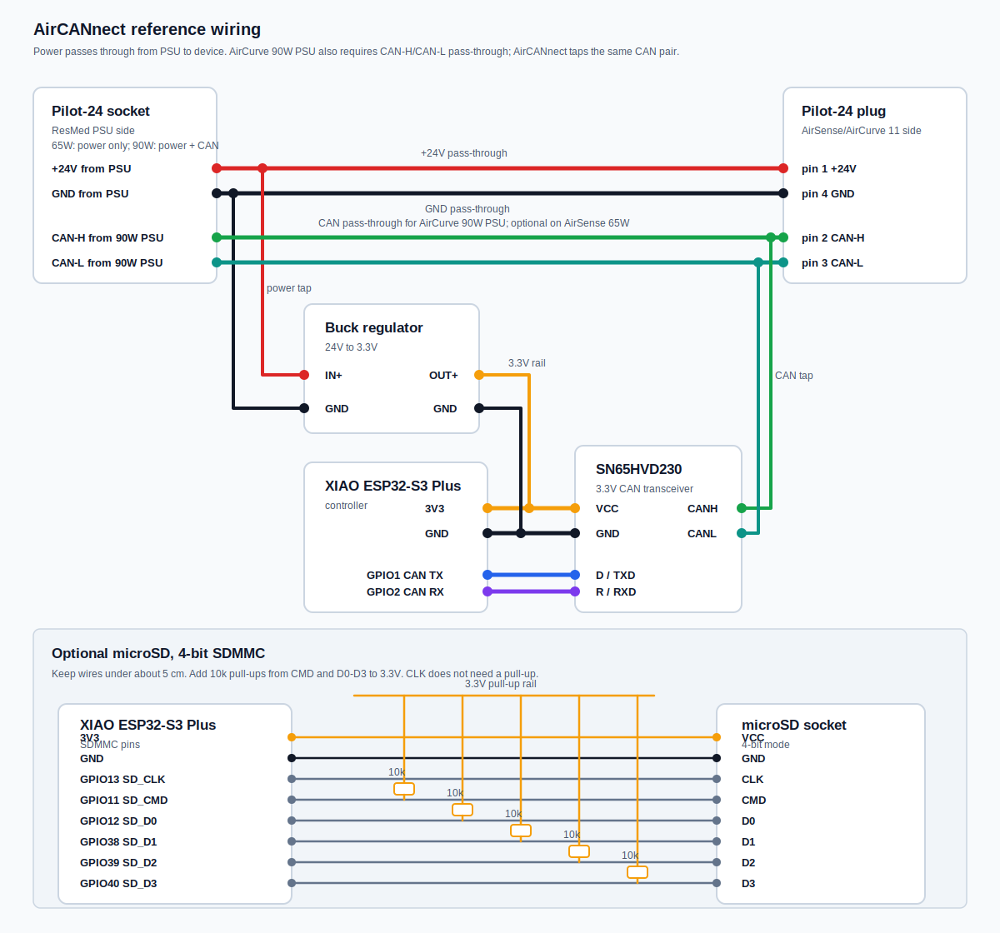

# AirCANnect Hardware

Build notes for the supported XIAO ESP32-S3 Plus reference hardware. Adapt
to other ESP32-S3 / ESP32 boards with `build_flags` overrides if needed.

## What you need

- **Mating connector** for the AirSense 11 / AirCurve 11 power input ([see below](#airsense-11-power-and-can-connector)).
- **XIAO ESP32-S3 Plus** (or any ESP32-S3 board with PSRAM and a few free GPIOs). PSRAM is useful for live therapy-data charts and large web responses.
- **3.3 V CAN transceiver** - SN65HVD230D-class.
- **24 V to 3.3 V buck regulator** - the AirSense 11 power line is 24 V; the ESP32 and transceiver both run on 3.3 V.
- **microSD card** *(optional)* - enables on-device storage, first-boot provisioning, `.abc` firmware staging, EDF capture, reports, file logging.

## Bare minimum hardware diagram

Default wiring for the `xiao-esp32s3-plus-sdmmc4` profile:



AirCANnect sits in-line between the ResMed PSU and the AirSense. +24 V
and GND pass through to the AirSense; AirCANnect taps them locally for
the buck regulator.

For AirSense 11 with the 65 W PSU, PSU-side CAN is optional. \
For AirCurve 11 with the 90 W PSU, the PSU identification uses CAN bus
and the cable uses all four connector pins. In that build, CAN-H and CAN-L
must pass through from the PSU connector to the AirCurve connector,
and the AirCANnect CAN transceiver must tap that same pass-through CAN pair.

Signal summary:

| From | To |
|---|---|
| PSU +24 V | AirSense `+24V` and buck `Vin` |
| PSU GND | AirSense `GND`, buck `GND`, XIAO `GND`, transceiver `GND` |
| PSU `CAN-H` / `CAN-L` | AirCurve `CAN-H` / `CAN-L` pass-through *(90 W PSU only)* |
| Buck 3.3 V output | XIAO `3V3` and transceiver `VCC` |
| XIAO GPIO1 CAN TX | Transceiver `D` / `TXD` |
| XIAO GPIO2 CAN RX | Transceiver `R` / `RXD` |
| Transceiver `CANH` | AirSense `CAN-H` |
| Transceiver `CANL` | AirSense `CAN-L` |

Optional microSD wiring is shown in the diagram and repeated in the pin
assignment section below. Keep SDMMC wires short, ideally under 5 cm.

## AirSense 11 power-and-CAN connector

**Pinout (device side):**

| Pin | Signal |
|---|---|
| 1 | +24 V |
| 2 | CAN-H |
| 3 | CAN-L |
| 4 | GND |


**Sourcing.** The original plug and socket are custom OEM parts. The
most practical source is salvaging a Pilot-24 cable kit ([Amazon
B0B3F7ZY65](https://www.amazon.com/dp/B0B3F7ZY65)) - you need both
ends, since AirCANnect sits between the PSU and AirSense: the socket
takes the PSU, the plug goes into AirSense, and the bridge wiring
runs between them. See [airbreak-plus AS11 CAN connection
notes](https://github.com/m-kozlowski/airbreak-plus/blob/master/docs/as11/can_connection.md)
for photos and additional context.


## Power

24 V from the AirSense feeds a step-down regulator that produces 3.3 V for
the ESP32. Reference part:
[SparkFun COM-18357 (AP63203 buck)](https://www.sparkfun.com/products/18357) -
small, comfortable headroom for the ESP32-S3 + BLE peak draw. Any 24 V to
3.3 V buck with >=1 A capability works; no hard requirement on the specific
part.

## CAN transceiver

A 3.3 V CAN transceiver sits between the ESP32 TWAI pins and the AS11 bus.
Reference part: a generic **SN65HVD230** break-out board - the small blue
PCBs sold everywhere as "CAN bus module" or similar. Any 3.3 V high-speed
CAN transceiver works; no hard requirement on the specific part or board.

Wiring:

- ESP32 CAN TX -> transceiver `D` / `TXD`
- ESP32 CAN RX <- transceiver `R` / `RXD`
- Transceiver `VCC` -> 3.3 V 
- Transceiver `CANH` / `CANL` -> AS11 connector pins 2 / 3
- ESP32 `GND` -> transceiver `GND`
- Transceiver `GND` -> AS11 connector pin 4 (GND)

## XIAO ESP32-S3 Plus pin assignments

These are the defaults for the `xiao-esp32s3-plus-sdmmc4` build (the
project's `default_envs`). Override at build time via `build_flags` if you
wire differently.

```text
CAN
  TX (to transceiver D/TXD)    GPIO 1
  RX (from transceiver R/RXD)  GPIO 2

microSD (4-bit SDMMC)
  CLK     GPIO 13
  CMD     GPIO 11
  D0      GPIO 12
  D1      GPIO 38
  D2      GPIO 39
  D3      GPIO 40
```

Other build profiles:

- `xiao-esp32s3-plus-sdmmc1` - 1-bit SDMMC; only `CLK` / `CMD` / `D0` wired.
- `xiao-esp32s3-plus-spisd` - SPI-mode SD fallback for 4-wire SD modules: `CS` GPIO 10, `SCK` GPIO 13, `MISO` GPIO 12, `MOSI` GPIO 11.
- `xiao-esp32s3-plus` - no SD wired; PSRAM still available for stream pool and web buffers.

## Wiring tips

CAN at 1 Mbit/s and 4-bit SDMMC at 40 MHz both suffer from sloppy wiring.
Practical targets:

**CAN bus.**

- ESP32 to transceiver: keep under 10 cm. Perfboard or short jumpers.
- Transceiver to AS11 connector: under 1 m. Twisted pair for `CANH` /
  `CANL` past ~30 cm.
- CAN spec wants **120 Ohm across `CANH` / `CANL` at each physical end**
  of the bus. The AS11 terminates its own end internally; the transceiver
  side terminates the other. Most generic SN65HVD230 break-out boards
  already include a 120 Ohm resistor (sometimes with a removable jumper) -
  leave it in. If your board does not have one, add it.

**Power leg.**

- 24 V and GND from AS11 to buck: under 1 m of 22-24 AWG wire.

**microSD.** 40 MHz SDMMC is unforgiving:

- Short wires only - under 5 cm from each SD pin to the GPIO. Socket
  choice matters less than how short you wire it.
- Avoid the long (20 cm) Dupont jumpers - they cause intermittent
  card-not-detected and CRC errors.
- The SD spec requires pull-ups on `CMD` and `D0`-`D3`. ESP32-S3
  internal pull-ups (~45 kOhm) are marginal at SDMMC speed - add external
  **10 kOhm pull-ups to 3.3 V** on `CMD` and each `D0`-`D3` line. `CLK`
  does not need one.


For first-boot, flash, and CAN-link test steps, see
[quickstart.md](quickstart.md).
