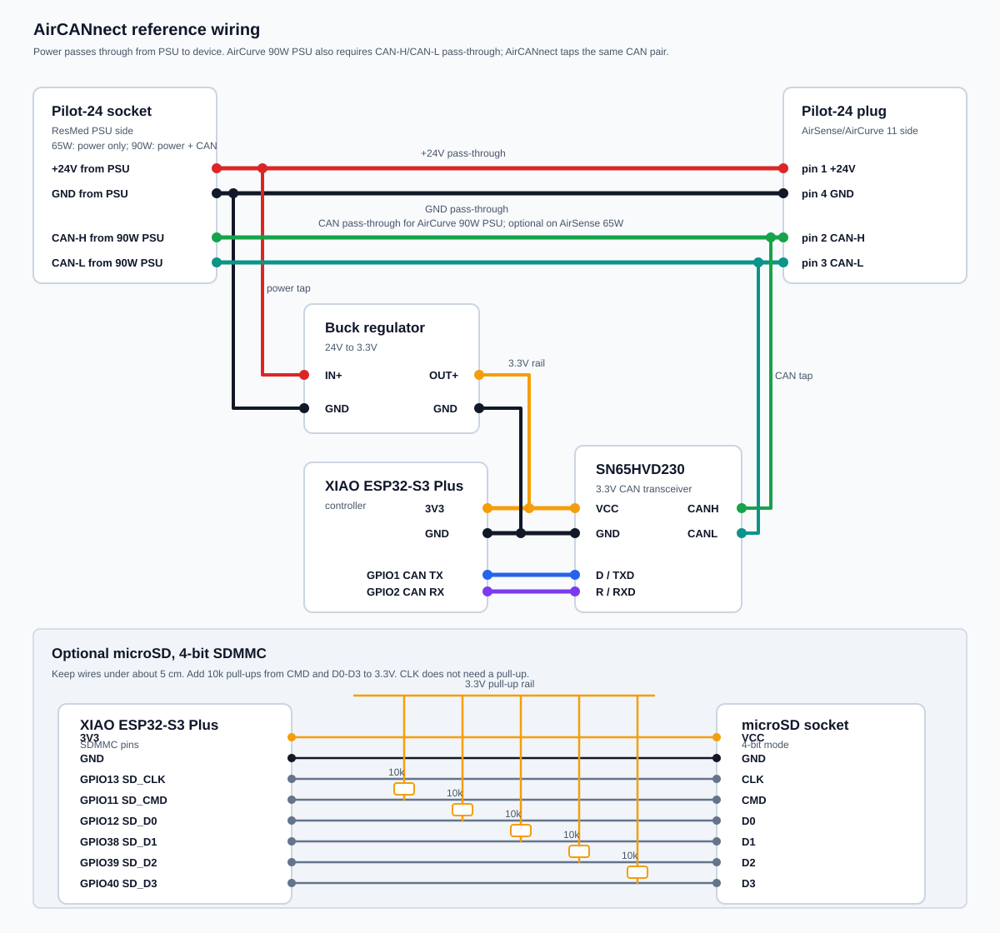

# AirCANnect Hardware

Build notes for supported ESP32-S3 targets. AirCANnect assumes PSRAM and
microSD storage. CAN and BLE are independent build capabilities; a board may
provide either or both.

## Choose a hardware path

| Setup | Assembly | AS11 connection |
| --- | --- | --- |
| [**Waveshare ESP32-S3-Touch-LCD-1.54**](https://docs.waveshare.com/ESP32-S3-Touch-LCD-1.54) | **No soldering required.** Insert a microSD card and power the board over USB. | BLE pairing from the setup wizard. |
| **XIAO ESP32-S3 Plus over BLE** | Wire an external microSD socket or module to the XIAO. USB can provide power. | BLE pairing from the setup wizard; no CAN transceiver or AS11 cable is needed. |
| **XIAO ESP32-S3 Plus over CAN** | Full hardware assembly: external microSD, CAN transceiver, buck regulator, and AS11 cable. | Physical CAN connection. |

The Waveshare profile is the ready-made option when no soldering is desired.
Its display, button, accelerometer, microSD slot, USB power, and BLE radio are
already onboard. Its speaker can be used for configured local alerts. Adding
physical CAN to it is possible, but requires an
external transceiver, wiring, and a custom build.

The published XIAO profiles use an external microSD card in either 4-bit SDMMC
or SPI mode. Reliable SD wiring should be short and soldered; breadboard and
long jumper-wire builds are unsuitable for regular use.

## Parts by capability

- **Every setup:** a supported ESP32-S3 board with PSRAM and a microSD card.
- **XIAO setups:** an external microSD socket or module and its wiring.
- **Physical CAN setups:** a mating AS11 power connector, 3.3 V CAN
  transceiver, 24 V to 3.3 V buck regulator, and the wiring described below.

The microSD card provides first-boot provisioning, EDF capture, reports, file
logging, and the ResMed firmware repository.

## XIAO CAN wiring

Default wiring for the `xiao-esp32s3-plus-sdmmc4` profile:



This diagram is not needed for the standard Waveshare BLE setup.

AirCANnect sits in-line between the ResMed PSU and the AirSense. +24 V
and GND pass through to the AirSense; AirCANnect taps them locally for
the buck regulator.

For AirSense 11 with the 65 W PSU, PSU-side CAN is optional. \
For AirCurve 11 with the 90 W PSU, the PSU identification uses CAN bus
and the cable uses all four connector pins. In that build, CAN-H and CAN-L
must pass through from the PSU connector to the AirCurve connector,
and the AirCANnect CAN transceiver must tap that same pass-through CAN pair.

Signal summary:

| From | To |
|---|---|
| PSU +24 V | AirSense `+24V` and buck `Vin` |
| PSU GND | AirSense `GND`, buck `GND`, XIAO `GND`, transceiver `GND` |
| PSU `CAN-H` / `CAN-L` | AirCurve `CAN-H` / `CAN-L` pass-through *(90 W PSU only)* |
| Buck 3.3 V output | XIAO `3V3` and transceiver `VCC` |
| XIAO GPIO1 CAN TX | Transceiver `D` / `TXD` |
| XIAO GPIO2 CAN RX | Transceiver `R` / `RXD` |
| Transceiver `CANH` | AirSense `CAN-H` |
| Transceiver `CANL` | AirSense `CAN-L` |

The microSD wiring is shown in the diagram and repeated in the pin assignment
section below. Keep SDMMC wires short, ideally under 5 cm.

## AirSense 11 power-and-CAN connector

**Pinout (device side):**

| Pin | Signal |
|---|---|
| 1 | +24 V |
| 2 | CAN-H |
| 3 | CAN-L |
| 4 | GND |


**Sourcing.** The original plug and socket are custom OEM parts. The
most practical source is salvaging a Pilot-24 cable kit ([Amazon
B0B3F7ZY65](https://www.amazon.com/dp/B0B3F7ZY65)) - you need both
ends, since AirCANnect sits between the PSU and AirSense: the socket
takes the PSU, the plug goes into AirSense, and the bridge wiring
runs between them. See [airbreak-plus AS11 CAN connection
notes](https://github.com/m-kozlowski/airbreak-plus/blob/master/docs/as11/can_connection.md)
for photos and additional context.


## Power

24 V from the AirSense feeds a step-down regulator that produces 3.3 V for
the ESP32. Reference part:
[SparkFun COM-18357 (AP63203 buck)](https://www.sparkfun.com/products/18357) -
small, comfortable headroom for the ESP32-S3 + BLE peak draw. Any 24 V to
3.3 V buck with >=1 A capability works; no hard requirement on the specific
part.

## CAN transceiver

A 3.3 V CAN transceiver sits between the ESP32 TWAI pins and the AS11 bus.
Reference part: a generic **SN65HVD230** break-out board - the small blue
PCBs sold everywhere as "CAN bus module" or similar. Any 3.3 V high-speed
CAN transceiver works; no hard requirement on the specific part or board.

Wiring:

- ESP32 CAN TX -> transceiver `D` / `TXD`
- ESP32 CAN RX <- transceiver `R` / `RXD`
- Transceiver `VCC` -> 3.3 V 
- Transceiver `CANH` / `CANL` -> AS11 connector pins 2 / 3
- ESP32 `GND` -> transceiver `GND`
- Transceiver `GND` -> AS11 connector pin 4 (GND)

## XIAO ESP32-S3 Plus pin assignments

These are the defaults for the `xiao-esp32s3-plus-sdmmc4` build (the
project's `default_envs`). Override at build time via `build_flags` if you
wire differently.

```text
CAN
  TX (to transceiver D/TXD)    GPIO 1
  RX (from transceiver R/RXD)  GPIO 2

microSD (4-bit SDMMC)
  CLK     GPIO 13
  CMD     GPIO 11
  D0      GPIO 12
  D1      GPIO 38
  D2      GPIO 39
  D3      GPIO 40
```

Supported storage profiles:

- `xiao-esp32s3-plus-spisd` - SPI-mode SD fallback for 4-wire SD modules: `CS` GPIO 10, `SCK` GPIO 13, `MISO` GPIO 12, `MOSI` GPIO 11.

## Waveshare ESP32-S3-Touch-LCD-1.54

The `waveshare-esp32s3-touch-lcd-1-54` profile uses the board's 16 MB flash,
8 MB PSRAM, native USB CDC, and onboard microSD slot:

```text
microSD (4-bit SDMMC)
  CLK     GPIO 16
  CMD     GPIO 15
  D0      GPIO 17
  D1      GPIO 18
  D2      GPIO 13
  D3      GPIO 14
```

It defaults to `as11_transport=ble`, so pairing is completed from onboarding
or the Config tab. The LCD shows time, Air11, Wi-Fi, and export status while
idle, with additional pages for the latest night and 30-day summary. During
therapy it shows elapsed time, algorithm pressure, fresh oximetry when
available, and a second page of current respiratory values. BOOT and PLUS move
between pages. PWR toggles the backlight on a short press and starts or stops
therapy on a long press. Touch is not initialized.

Display and button support are build capabilities, not board identities. A
display driver is selected with `AC_DISPLAY_DRIVER` and described by its pin,
size, rotation, and backlight flags. `AC_BUTTON_PROFILE` independently selects
a catalog containing any number of buttons, their electrical configuration,
supported gestures, and default actions. Future board profiles can therefore
use another resolution, display backend, or button layout without changing
the dashboard or action owners.

CAN is a build capability rather than a board identity. A custom environment
may extend this profile, remove its inherited `-DAC_CAN_ENABLED=0` with
`build_unflags`, then set `AC_CAN_ENABLED=1`, `AC_CAN_TX_GPIO`,
`AC_CAN_RX_GPIO`, and the appropriate timing after an external transceiver
has been wired. Likewise, any XIAO environment can set `AC_CAN_ENABLED=0` for
a BLE-only build.

## Wiring tips

CAN at 1 Mbit/s and 4-bit SDMMC at 40 MHz both suffer from sloppy wiring.
Practical targets:

**CAN bus.**

- ESP32 to transceiver: keep under 10 cm. Perfboard or short jumpers.
- Transceiver to AS11 connector: under 1 m. Twisted pair for `CANH` /
  `CANL` past ~30 cm.
- CAN spec wants **120 Ohm across `CANH` / `CANL` at each physical end**
  of the bus. The AS11 terminates its own end internally; the transceiver
  side terminates the other. Most generic SN65HVD230 break-out boards
  already include a 120 Ohm resistor (sometimes with a removable jumper) -
  leave it in. If your board does not have one, add it.

**Power leg.**

- 24 V and GND from AS11 to buck: under 1 m of 22-24 AWG wire.

**microSD.** 40 MHz SDMMC is unforgiving:

- Short wires only - under 5 cm from each SD pin to the GPIO. Socket
  choice matters less than how short you wire it.
- Avoid the long (20 cm) Dupont jumpers - they cause intermittent
  card-not-detected and CRC errors.
- The SD spec requires pull-ups on `CMD` and `D0`-`D3`. ESP32-S3
  internal pull-ups (~45 kOhm) are marginal at SDMMC speed - add external
  **10 kOhm pull-ups to 3.3 V** on `CMD` and each `D0`-`D3` line. `CLK`
  does not need one.


For first-boot, flash, and CAN-link test steps, see
[quickstart.md](quickstart.md).
